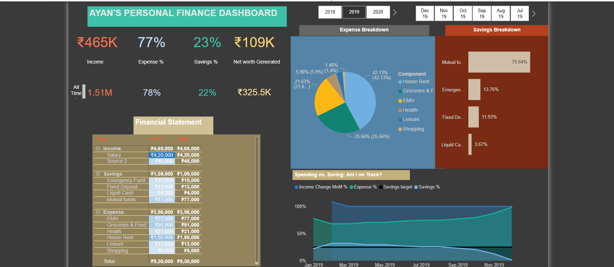
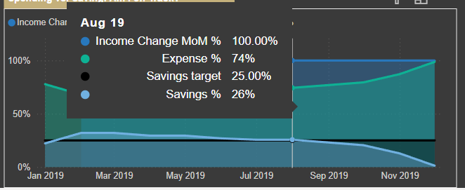
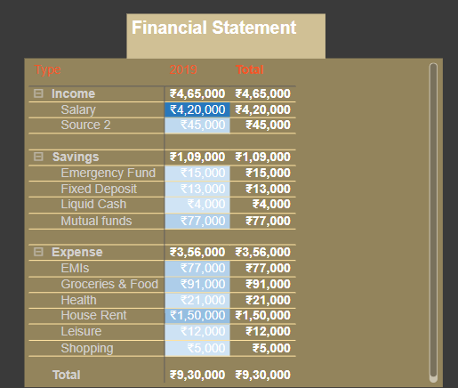
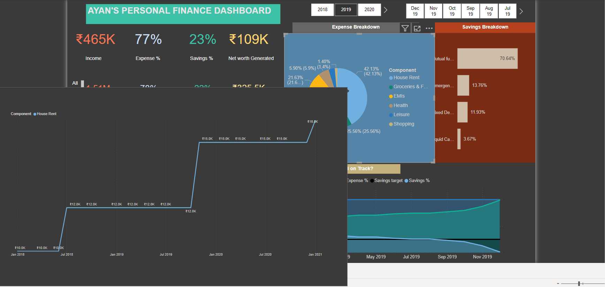
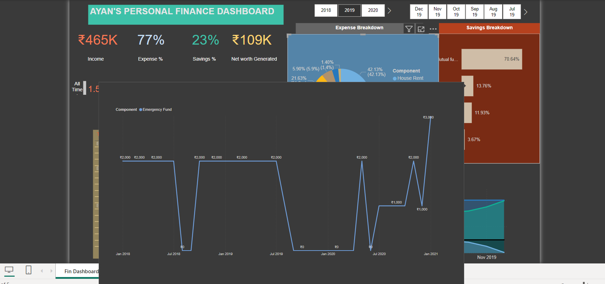

# Personal Finance Dashboard

An interactive dashboard created using Power BI to manage and visualize personal financial data.

– Built a comprehensive Personal Finance Dashboard using Power BI to monitor key financial metrics such as income,expenses, savings, and net worth.

– Developed a timeline and trend analysis feature to track financial performance over time, enabling users to observe patterns and growth in their finances.

– Enhanced financial decision-making by providing a clear, dynamic overview of spending habits, savings progress, and
overall net worth through the dashboard.

## Screenshots
### Dashbaord

### Expense vs Savings Timeline

### Financial Statement

### Individual Component of Expense: Graph, Timeline, and Trend Analysis

### Individual Component of Expense: Graph, Timeline, and Trend Analysis

